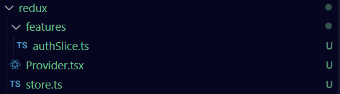

# Persist Redux

## structure


## code
authSlice.ts
```ts
import { createSlice } from "@reduxjs/toolkit";
import type { PayloadAction } from "@reduxjs/toolkit";

export interface IAuthState {
  authState: boolean;
}

const initialState: IAuthState = {
  authState: false,
};

export const authSlice = createSlice({
  name: "auth",
  initialState,
  reducers: {
    setAuthState: (state, action: PayloadAction<boolean>) => {
      state.authState = action.payload;
    },
  },
});

export const { setAuthState } = authSlice.actions;
export const authReducer = authSlice.reducer;
```

Provider.tsx
```ts
"use client";

import { Provider } from "react-redux";
import { store } from "./store";
import { persistStore } from "redux-persist";

persistStore(store);
export default function ReduxProvider({
  children,
}: {
  children: React.ReactNode;
}) {
  return <Provider store={store}>{children}</Provider>;
}
```

store.ts
```ts
import { combineReducers, configureStore } from "@reduxjs/toolkit";
import { useDispatch, TypedUseSelectorHook, useSelector } from "react-redux";
import { persistReducer } from "redux-persist";
import { authReducer } from "@/redux/features/authSlice";
import createWebStorage from "redux-persist/lib/storage/createWebStorage";
import CryptoJS from "crypto-js";

const createNoopStorage = () => {
  return {
    getItem() {
      return Promise.resolve(null);
    },
    setItem(_key: string, value: string) {
      return Promise.resolve(value);
    },
    removeItem() {
      return Promise.resolve();
    },
  };
};

const storage =
  typeof window !== "undefined"
    ? createWebStorage("session")
    : createNoopStorage();

const secretKey = "my-secret-key"; // Replace with an environment variable in production

const encrypt = (value: any) =>
  CryptoJS.AES.encrypt(JSON.stringify(value), secretKey).toString();

const decrypt = (value: string) => {
  const bytes = CryptoJS.AES.decrypt(value, secretKey);
  return JSON.parse(bytes.toString(CryptoJS.enc.Utf8));
};

const secureStorage = {
  getItem: (key: string) =>
    storage
      .getItem(key)
      .then((value) => (value ? decrypt(value) : null))
      .catch(() => null),
  setItem: (key: string, value: any) =>
    storage.setItem(key, encrypt(value)),
  removeItem: (key: string) => storage.removeItem(key),
};


const authPersistConfig = {
  key: "auth",
  storage: secureStorage,
  whitelist: ["authState"],
};

const persistedReducer = persistReducer(authPersistConfig, authReducer);

const rootReducer = combineReducers({
  auth: persistedReducer,
});

export const store = configureStore({
  reducer: rootReducer,
  middleware: (getDefaultMiddleware) =>
    getDefaultMiddleware({ serializableCheck: false }),
});

export type RootState = ReturnType<typeof store.getState>;
export type AppDispatch = typeof store.dispatch;

export const useAppDispatch = () => useDispatch<AppDispatch>();
export const useAppSelector: TypedUseSelectorHook<RootState> = useSelector;
```
